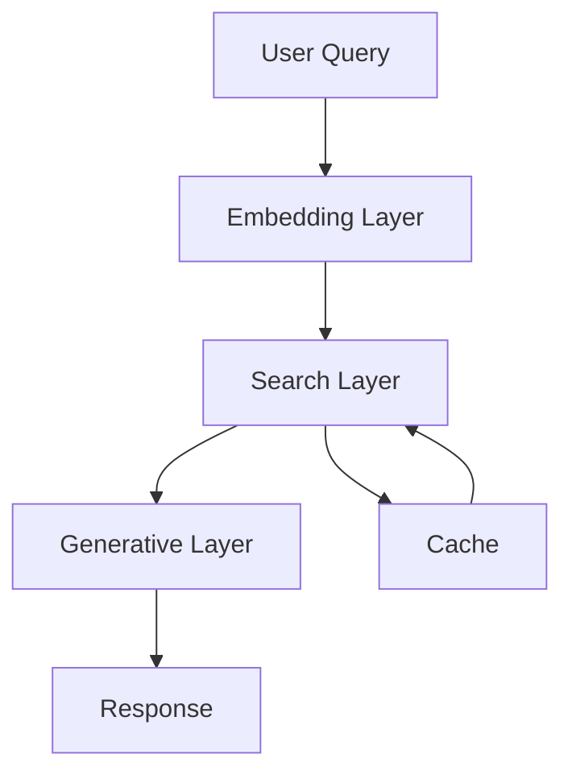

# LincolnBot - AI-Powered Parking Information Assistant

LincolnBot is an intelligent assistant that helps users find accurate information about parking rules, permits, and penalties in Lincoln City. It combines semantic search with generative AI to provide contextually relevant and accurate responses.

## Features

- **Semantic Search**: Advanced search capabilities using bi-encoder and cross-encoder models
- **Context-Aware Responses**: Generates natural language responses based on search results
- **Performance Optimization**: Redis-based caching with dynamic TTL
- **Response Validation**: Ensures accuracy and completeness of generated responses
- **Query Analysis**: Analyzes query patterns for optimization

## System Architecture

The system follows a three-layer architecture:

1. **Embedding Layer**: Processes and vectorizes text data
2. **Search Layer**: Performs semantic search and re-ranking
3. **Generative Layer**: Generates natural language responses



## Installation

### Prerequisites

- Python 3.9+
- Redis server
- OpenAI API key

### Setup

1. Clone the repository:
```bash
git clone https://github.com/yourusername/LincolnBot.git
cd LincolnBot
```

2. Install dependencies:
```bash
pip install -r requirements.txt
```

3. Set up environment variables:
```bash
cp .env.example .env
# Edit .env with your OpenAI API key and Redis configuration
```

4. Initialize the database:
```bash
python init_db.py
```

## Usage

### Running the Application

1. Start the Redis server:
```bash
redis-server
```

2. Run the main application:
```bash
python main.py
```

### Example Queries

1. Parking Rules:
```python
query = "What are the parking rules in Lincoln City?"
```

2. Permit Costs:
```python
query = "How much does a resident parking permit cost?"
```

3. Penalties:
```python
query = "What are the penalties for parking violations?"
```

## Technical Components

### Search Engine

The search engine (`search_engine.py`) implements:
- Semantic search using bi-encoder
- Re-ranking using cross-encoder
- Redis-based caching
- Performance metrics collection

### Response Generator

The response generator (`response_generator.py`) provides:
- Context-aware response generation
- Structured response format
- Fact verification

### Response Validator

The response validator (`response_validator.py`) ensures:
- Field-based validation
- Pattern matching
- Consistency checking

## Performance Metrics

The system tracks various performance metrics:
- Search latency
- Cache hit rate
- Response quality
- Query patterns

## Testing

Run the test suite:
```bash
python -m pytest tests/
```

## Contributing

1. Fork the repository
2. Create a feature branch
3. Commit your changes
4. Push to the branch
5. Create a Pull Request

## License

This project is licensed under the MIT License - see the LICENSE file for details.

## Acknowledgments

- OpenAI for GPT-4
- SentenceTransformers for embedding models
- ChromaDB for vector storage
- Redis for caching 